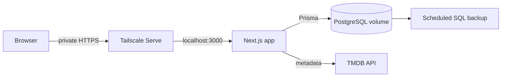

# SuperMovie

A personal, self-hosted tracker for movies, series, and books. Keep a library, record what you have watched or read, set goals, and look back at the year in a shareable Wrapped story.

**Stack:** Next.js 16 · TypeScript · PostgreSQL 17 · Prisma 6 · Docker Compose

## What it does

- Track movies and series with TMDB metadata, seasons, ratings, tags, and watch history.
- Track books and import a Goodreads library.
- Explore a watch calendar, goals, recommendations, and yearly stats.
- Share a read-only library or Wrapped story through a link you create.
- Export your data and run the app on your own server.

## Architecture



The default Compose stack runs the app and PostgreSQL. The app listens only on `127.0.0.1:3000`; Tailscale Serve can make it available to devices on your tailnet. An optional Caddy profile supports a public domain with HTTPS. Prisma migrations run when the app container starts. PostgreSQL data lives in a named Docker volume, and the repository includes a backup script and restore instructions.

This is deliberately a **single-user** application. Server Actions check the session before protected work, and the session is stored in an HTTP-only signed cookie. It does not require an external auth service or a multi-user account system.

## Run locally

Prerequisites: Node.js 24+, Docker, and a [TMDB API key](https://developer.themoviedb.org/docs/getting-started) for movie and series metadata.

```sh
docker run -d --name superapp-pg -p 5433:5432 -e POSTGRES_PASSWORD=postgres postgres:17-alpine
cp .env.example .env
# Set TMDB_API_KEY and replace the example auth values in .env.
npm ci
npx prisma migrate dev
npm run dev
```

Open <http://localhost:3000>. The development database URL in `.env.example` points to the PostgreSQL container above. Stop or remove an existing `superapp-pg` container before reusing that name.

## Self-host with Docker Compose

1. Copy `.env.example` to `.env` on the server. Set a unique `POSTGRES_PASSWORD`, `AUTH_USERNAME`, `AUTH_PASSWORD`, and `AUTH_SECRET` (at least 16 characters). Add a `TMDB_API_KEY` for metadata. Do not commit `.env`.
2. Run `docker compose up -d --build`. The app is now reachable on the server at `127.0.0.1:3000`.
3. For private HTTPS access, install Tailscale, join your tailnet, and run `tailscale serve --bg localhost:3000`. Set `AUTH_SECURE_COOKIE=true` in `.env` and recreate the app container.

The `domain` Compose profile runs Caddy if you want to expose a real domain instead. Configure its `SITE_ADDRESS` and DNS before using that profile. The default private setup needs no public inbound port.

## Data and recovery

- PostgreSQL lives in the `pgdata` Docker volume, which survives app rebuilds.
- `scripts/backup-db.sh` writes compressed database backups. To run it nightly with seven-day rotation, add a cron entry on the server:

  ```cron
  30 2 * * * /home/YOU/SuperMovie/scripts/backup-db.sh /home/YOU/SuperMovie
  ```

- Copy backups off the server as part of your own recovery plan.
- Restore a backup with `gunzip -c dump.sql.gz | docker compose exec -T db psql -U postgres superapp` after checking the configured database name and user.

## Repository layout

| Path           | Purpose                                                             |
| -------------- | ------------------------------------------------------------------- |
| `src/app/`     | Routes, layouts, and login                                          |
| `src/modules/` | Media, books, goals, history, recommendations, and Wrapped features |
| `src/lib/`     | Authentication, database access, and shared server utilities        |
| `prisma/`      | Schema and migrations                                               |
| `scripts/`     | Deployment and backup scripts                                       |

## Engineering choices

- **Private by default:** Compose binds the app to localhost, with Tailscale handling remote access.
- **Recoverable state:** migrations are committed, database storage survives container rebuilds, and backup and restore paths are documented.
- **Small operational footprint:** one web container, one database container, and no mandatory hosted services beyond TMDB metadata.

The app is actively developed as a personal project. It is designed for one account and has not been benchmarked as a multi-user service.
